

[Goto TalkIT](https://ibbabs.pythonanywhere.com/)

# TalkIT /tɔːk ai tee/

**TalkIT** is a mini web-based social platform for Tech Enthuasiats - Software Developer, Software Engineer, Low-Level Engineer, Game Developer, Website Dev and others. It is a platform to share your insights, knowledge, or even tech-related jokes/memes.

**TalkIT** is a composition of both Frontend and Backend technologies. Most of the backend processes are written with a Python package [Flask] including Database engine, and the frontend are handled with the three popular frontend technologies [HTML, CSS, and JavaScript]. All data are retrieved from a MySQL database using SQLAlchemy, a Python package.

# TalkIT Platform ROUTES:

- **/register** to the registration page
- **/login** to login page
- **/new_post** to a page where the user can create a new post
- **/edit/<post_id>** to editing a post page
- **/read_post/<post_id>** to a page where user can view more of the chosen post i.e full information about the post, like it, make a comment, and reply to the comment
- **/edit_profile/<user_id>** to current_user's profile editing page
- **/new_feed** to a page where other users' posts are, excluding the current user's post
- **/my_post** To the current user's posts page
- **/profile** - To the current user profile page
- **/edit_comment/<comment_id>** - To editing comment page
- **/delete_comment/<comment_id>** - Allows user to delete a his/her own comment
- **/delete_post/<post_id>** - Allows a current user to delete his/her post
- **/reset_request** To request password resetting page
- **/reset_token/<token>** - To resetting password page using generated token
- **/** or **/home** - To the landing page
- **/developer** - To the deveolper page
- **/other_user_profile/<other_user_id>** - To the other user profile page

<aside style='background-color: #20e1f8;'><h3>Note:</h3> MOST of these routes are protected i.e a user needsto be logged in before he/she can access them, while few of them are public (Needn't to be logged in)
</aside>

 

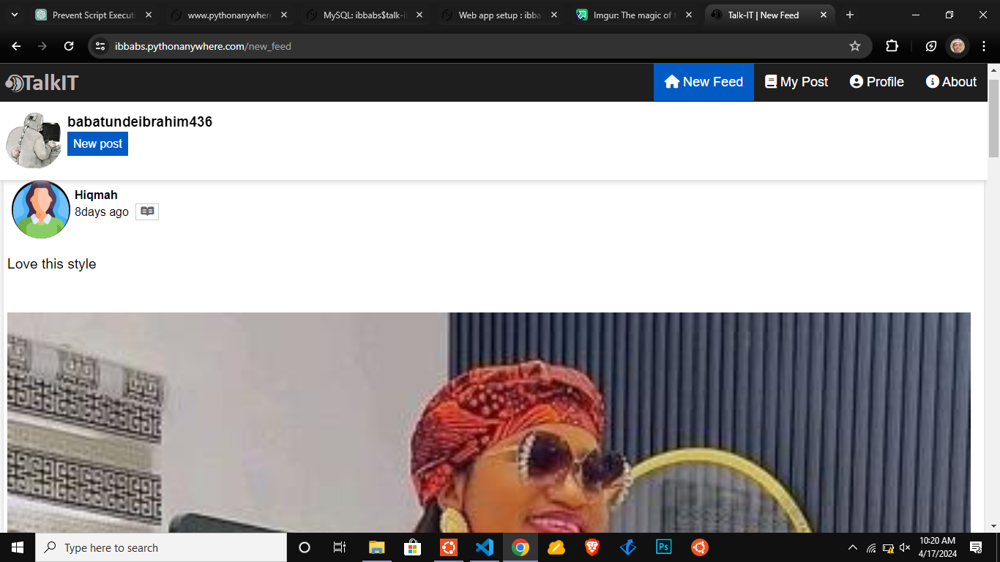
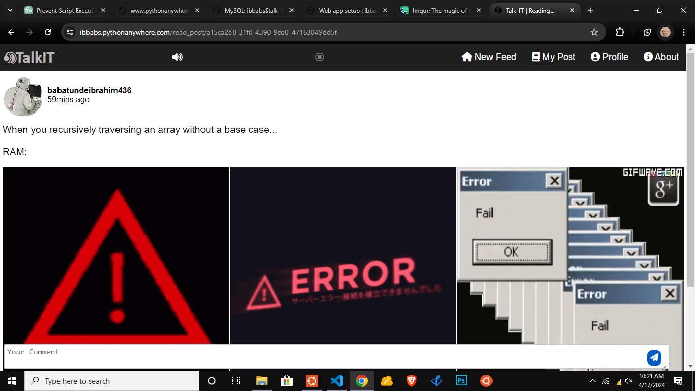
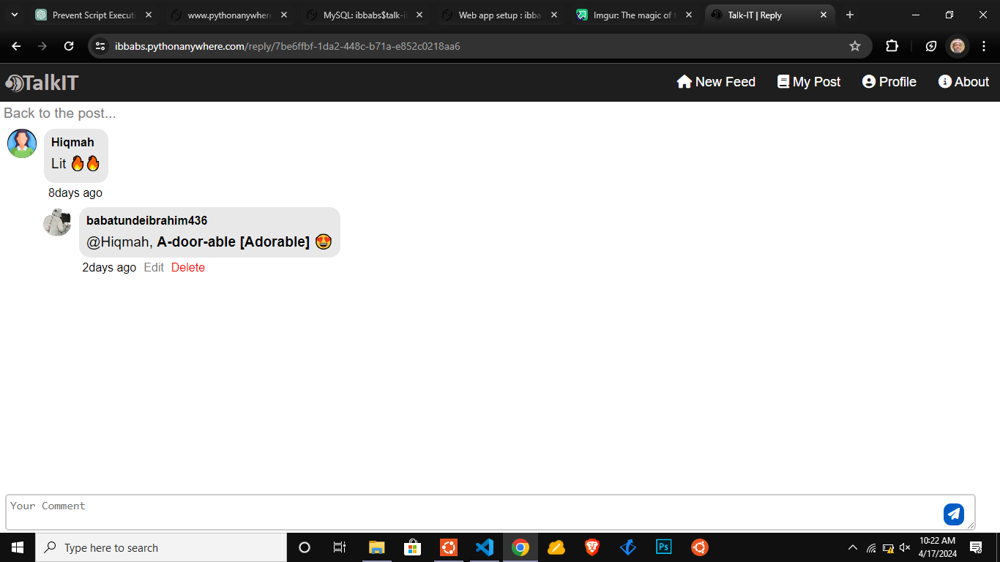
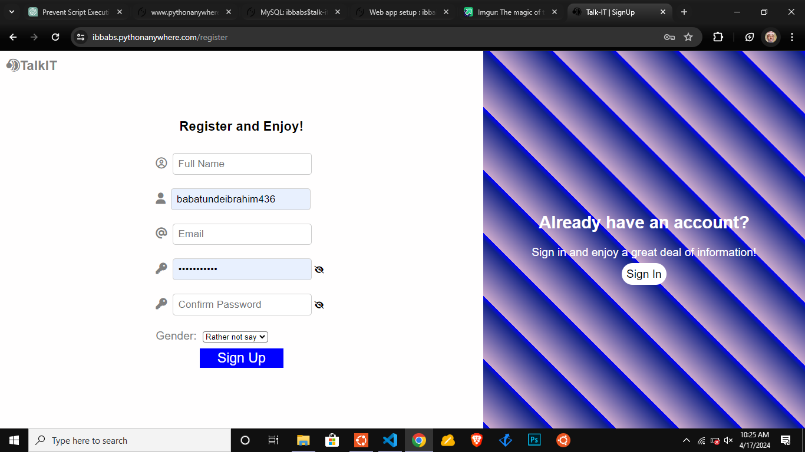
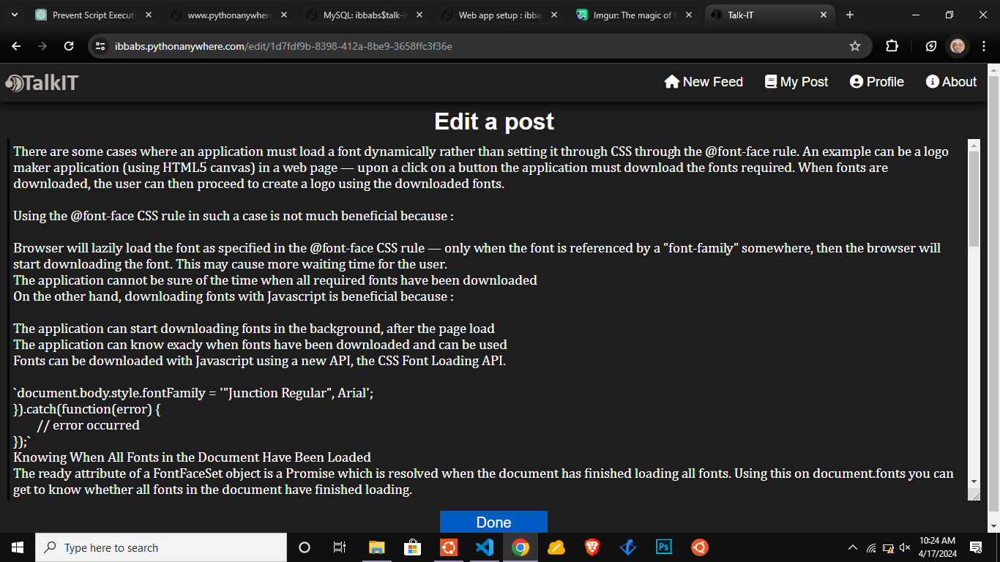
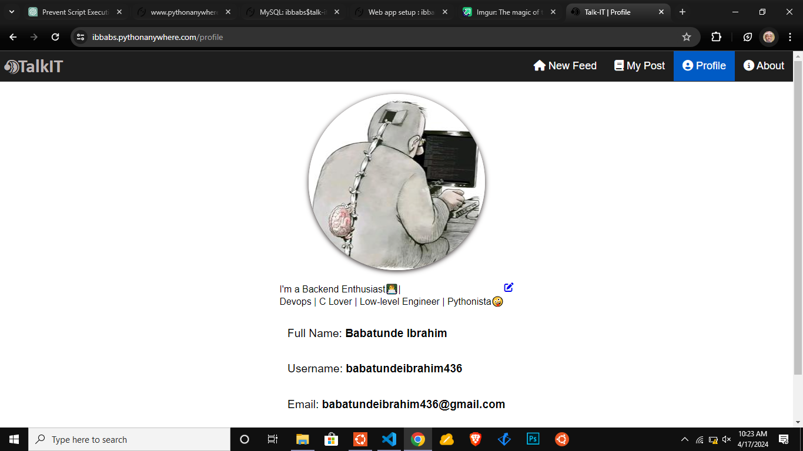
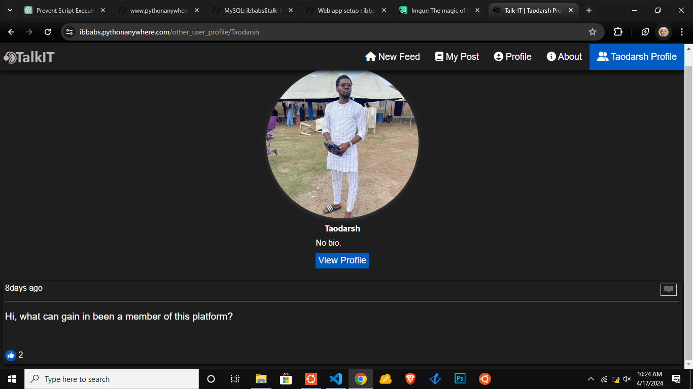

## FEATURES

Some of the features has TalkIT are:

- **Post** - User can make a post of any length of word and add a maximum of 10 images of any type[Optional]. The Images to be added are limited to 10 as a result of a memory space allocated for my free account on the website "[pythonanywhere](https://www.pythonanywhere.com)" I deployed this application to. It is 500mb and about 200mb has been used up. The image(s) added will be compressed to the size of 1000 x 1000 which will reduce the memory size of those/that image(s) before storing them in the folder specified on the server.

- **Comment** - As it is a tradition of every social platform to have a comment section integrated. **TalkIT** adopted the same culture. User can make comment under the post authored by another user or even the user him/herself.

- **Reply** - Give a reply to the comment made by the commenter. This creates a thread. It's universally known that once the post is deleted, all of its relations are deleted as well therefore, once a comment is deleted, the replies go with it.

- **Like** - **TalkIT** users can like and unlike a post
- **Share** - Ability to share the post has been implmented
- **Bio** - Users can have a bio as a short/long description about themselves.
- **Theme** - Light and dark theme. To activate this, click on the **TalkIT** logo/brand at the heading
  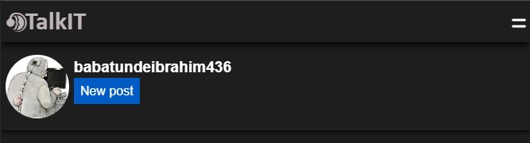

- **RICH-TEXT FORMATTING** - I tred _flask_tinymace_ for text formatting however, I encountered so many errors and warnings and therefore I decided to manually format the post, comment, and reply made by the users by extracting the needed text for formatting using **REGULAR EXPRESSION** from JavaScript. This took me a whole day before I finally came to the solution.

- **Link Extraction** - Links are formatted as a text with blue color. It is advisable for anyone who want to include a link in the post to prefixed the link by one of the internet protocol such as _https_, _http_, or _ftp_ in order to avoid any mistake when the link is processed. If a link is encountered or detected without any of the protocols, it is programmed to be prefixed by the secured protocol (_https://_).
  _And more!_

# HOW CAN YOU FORMAT POST, COMMENT, AND REPLY TEXT?

- Bold formatting: Surround the text (The beginning and the end) you want to bold with an asterisk(\*). EXAMPLE:
  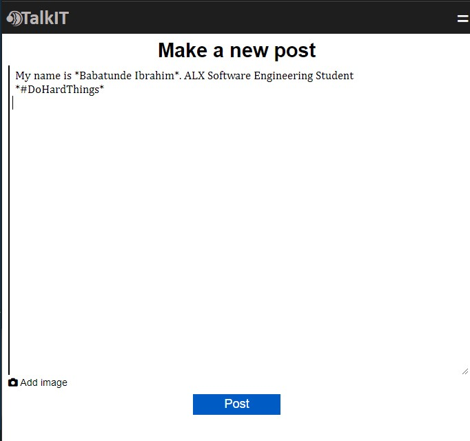

### Result

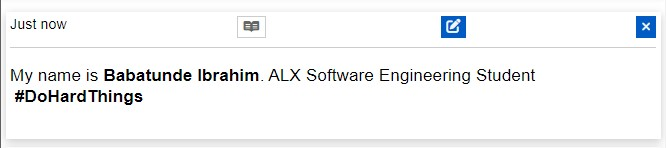

- Italics formatting: Surround the text (The beginning and the end) you want it to be italicized with an underscore (\_). EXAMPLE:
  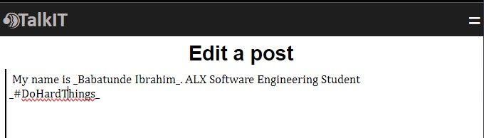

### Result

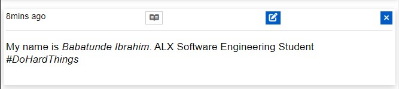

- Code formatting: Surround the text (The beginning and the end) you want it to be coded with a backward apostrophe typically called backtick or 'grave accent' (`). EXAMPLE:
  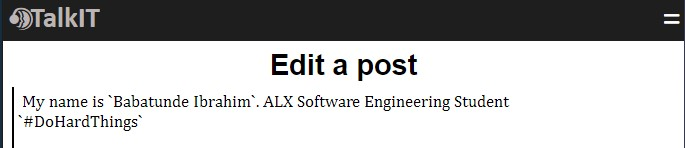

### Result

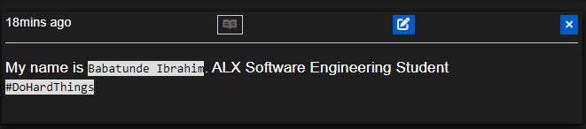

# DEPLOYMENT

Both application and the database are deployed/host on [pythonanywhere](https://www.pythonanywhere.com).

# ISSUE(S)

- ### With TalkIT Source Code:
  Any developer who wants to play around TalkIT source code and testing it on their local enviroment will encounter an issue/error (Wrong path issue) at the make_post page when the image(s) is/are added. REASON: The reason behind this issue/error is that on the website that I deployed the source code to takes a **getcwd()** property on **os** module as **/home/ib-bas/** and meanwhile it is a correct path during testing stage on the local environment.
  ### Remedy:
  Go to the application file named **app.py** and move on to line _122_, then remove _talk-IT_ and also in line _350_ too so that any post deleted will also be deleted with image(s) added if any. Check the images below:
  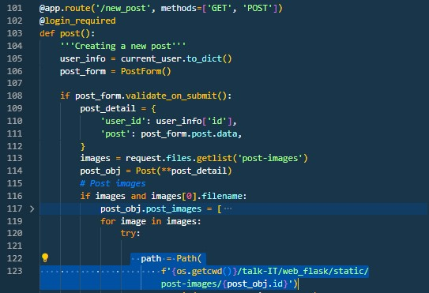
  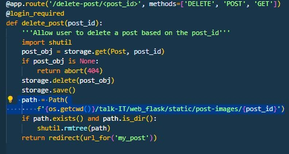
- ### On the site TalkIT is deployed to
  - As the account I have on [pythonanywhere](https://www.pythonanywhere.com) is a free account therefore, I need to stayed login and be reloading the app with the button named **Reload ib-babs.pythonanywhere.com** to load on the webpage about every 10 minutes otherwise the link will display 500 http status code and the site will be inaccessible. Also i couldn't add custom domain so my username is my domain name
    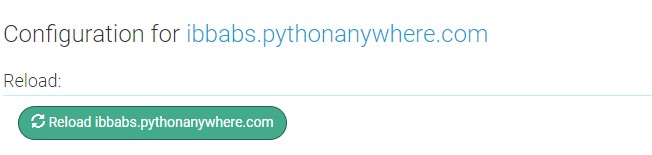

# ENVIRONMENT VARIABLES IN TalkIT FOR DEVELOPER

- TALK_IT_MYSQL_DB - Name of the MySQL database
- TALK_IT_MYSQL_HOST - MySQL Database host
- TALK_IT_MYSQL_USER - Username
- TALK_IT_MYSQL_PWD - MySQL database account password
- EMAIL_USER - The email username which resetting password link will be sent if a user request for password resetting.
- EMAIL_PASS - Email password. Note: You may encountered an error with the Email password even if the password provided is correct. SET up 2 Factor Validation and use the pass provided as the email password

# DEVELOPER

- Babatunde Ibrahim [babatundeibrahim436@gmail.com] [https://github.com/ib-babs]

### Portfolio Project

### TalkIT

### ALX - Software Engineering

### Holberton

### ENJOY!
