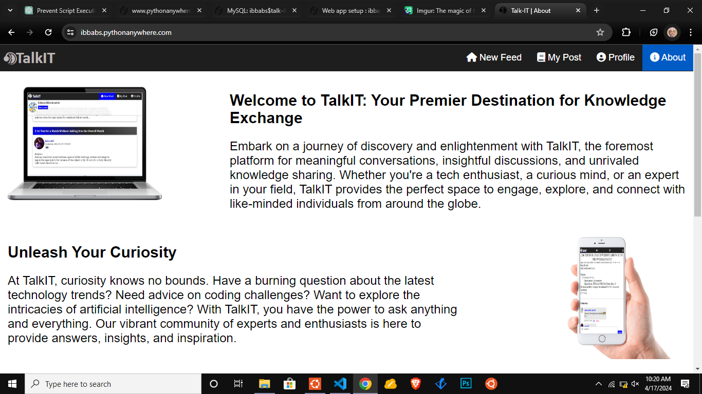
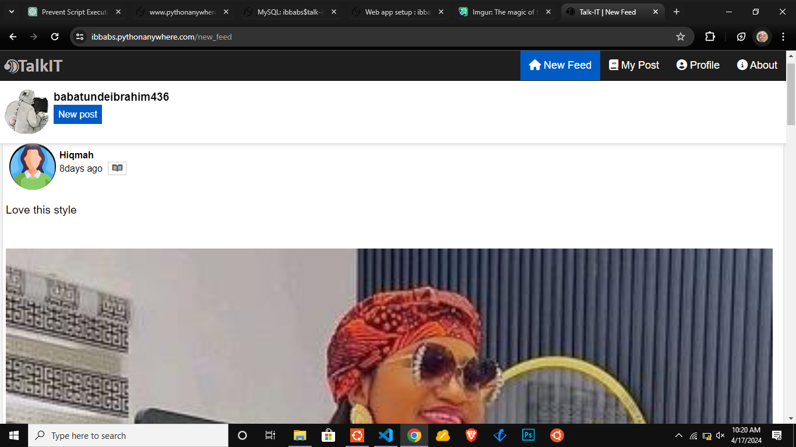
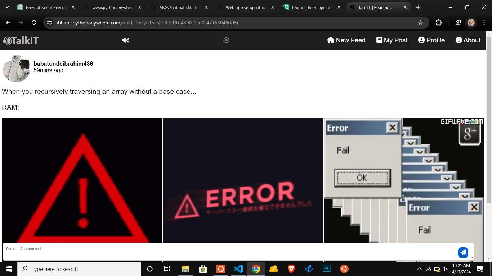
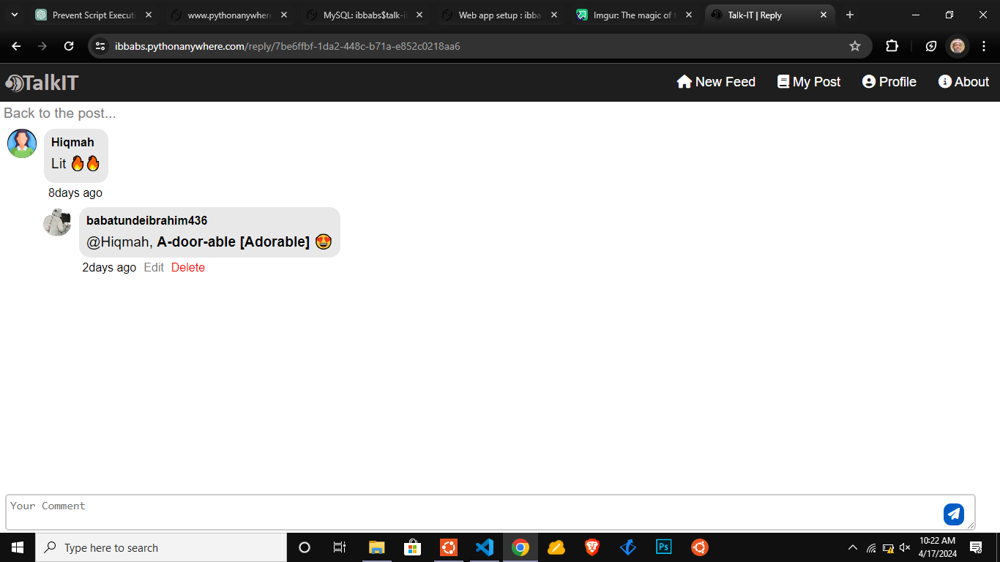
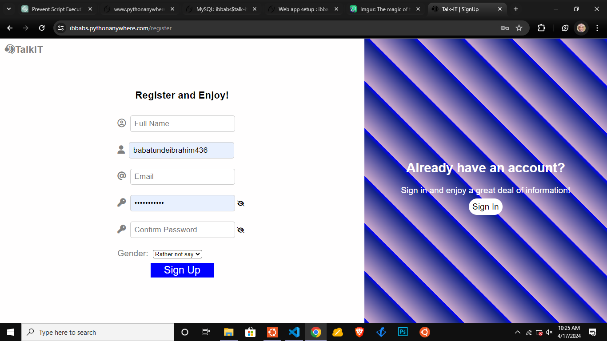
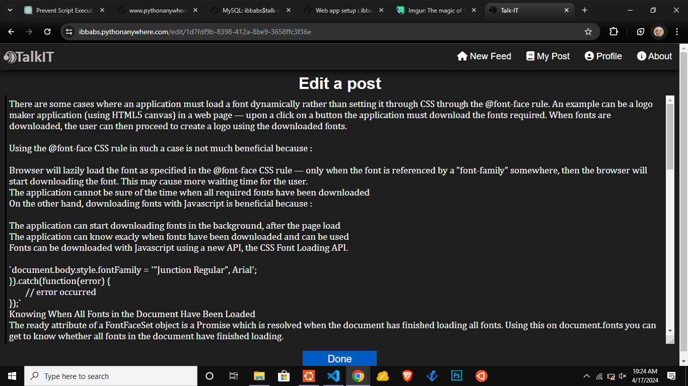
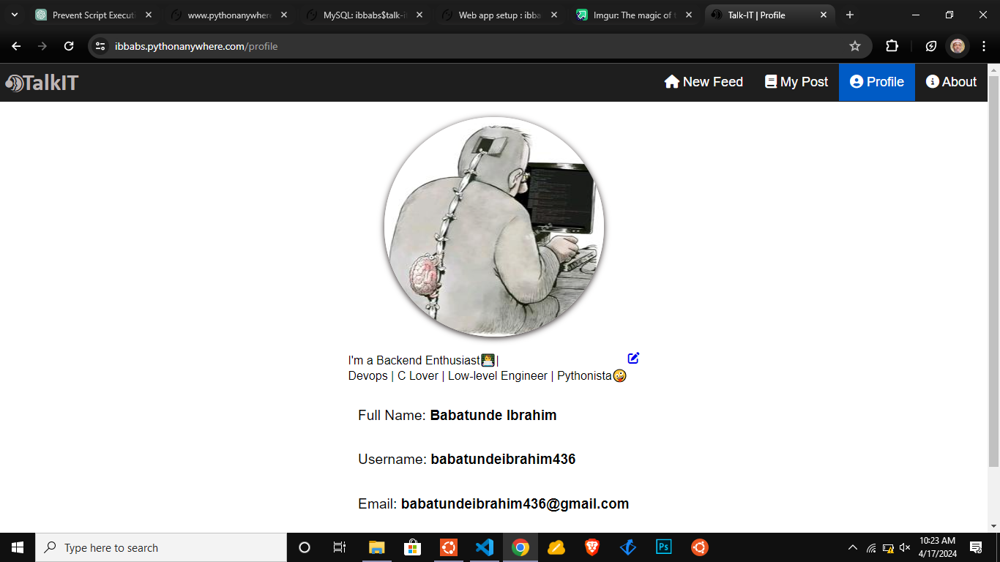
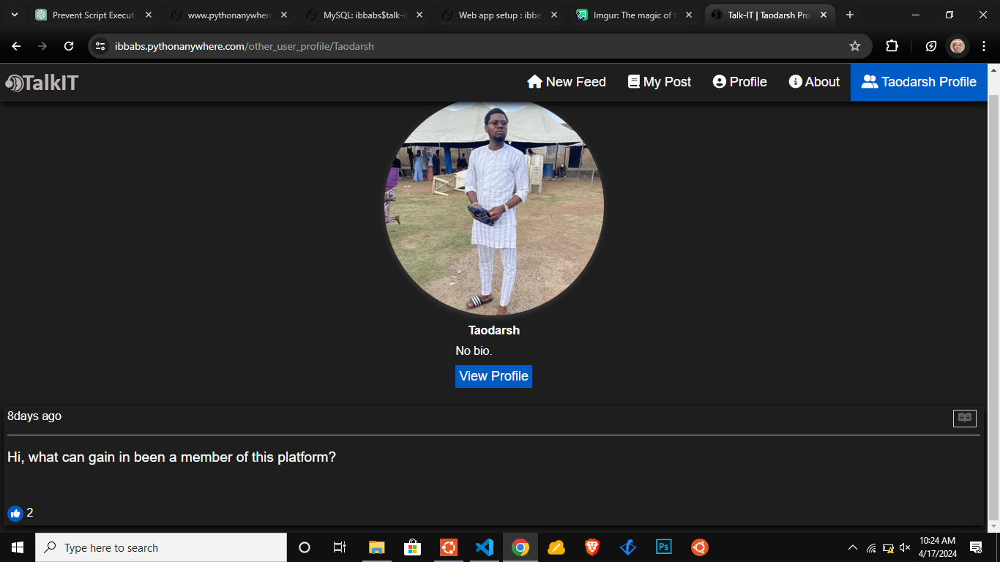

# TalkIT /tɔːk aI tee/

**TalkIT** is a mini web-based social platform for Tech Enthuasiats - Software Developer, Software Engineer, Low-Level Engineer, Game Developer, Website Dev and others. It is a platform to share your insights, knowledge, or even tech-related jokes/memes.
**TalkIT** is a comosition of both Frontend and Backend.

# TalkIT platform ROUTES:

- **/register** to the registration page
- **/login** to login page
- **/new_post** to a page where the user can create a new post
- **/edit/<post_id>** to editing a post page
- **/read_post/<post_id>** to a page where user can view more of the chosen post i.e full information about the post, like it, make a comment, and reply to the comment
- **/edit_profile/<user_id>** to current_user's profile editing page
- **/new_feed** to a page where other users' posts are, excluding the current user's post
- **/my_post** To the current user's posts page
- **/profile** - To the current user profile page
- **/edit_comment/<comment_id>** - To editing comment page
- **/delete_comment/<comment_id>** - Allows user to delete a his/her own comment
- **/delete_post/<post_id>** - Allows a current user to delete his/her post
- **/reset_request** To request password resetting page
- **/reset_token/<token>** - To resetting password page using generated token
- **/** or **/home** - To the landing page
- **/developer** - To the deveolper page
- **/other_user_profile/<other_user_id>** - To the other user profile page

<aside style='background-color: #20e1f8;'><h3>Note:</h3> MOST of these routes are protected i.e a user needsto be logged in before he/she can access them, while few of them are public (Needn't to be logged in)
</aside>

## USAGE
