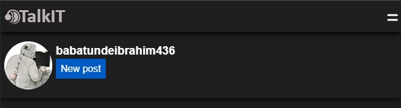
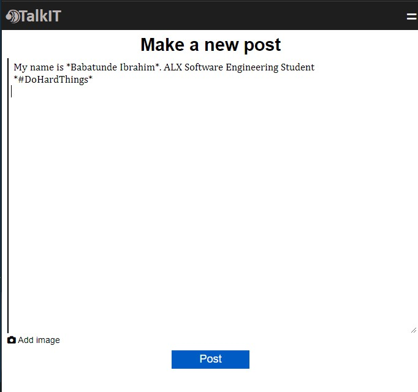
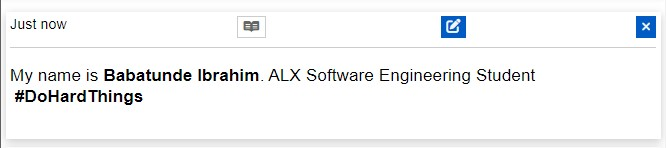
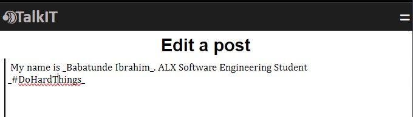
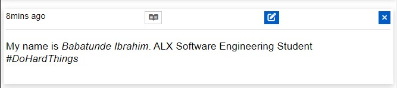
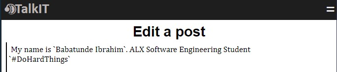

# TalkIT /tɔːk aI tee/

**TalkIT** is a mini web-based social platform for Tech Enthuasiats - Software Developer, Software Engineer, Low-Level Engineer, Game Developer, Website Dev and others. It is a platform to share your insights, knowledge, or even tech-related jokes/memes.
**TalkIT** is a comosition of both Frontend and Backend.

# TalkIT platform ROUTES:

- **/register** to the registration page
- **/login** to login page
- **/new_post** to a page where the user can create a new post
- **/edit/<post_id>** to editing a post page
- **/read_post/<post_id>** to a page where user can view more of the chosen post i.e full information about the post, like it, make a comment, and reply to the comment
- **/edit_profile/<user_id>** to current_user's profile editing page
- **/new_feed** to a page where other users' posts are, excluding the current user's post
- **/my_post** To the current user's posts page
- **/profile** - To the current user profile page
- **/edit_comment/<comment_id>** - To editing comment page
- **/delete_comment/<comment_id>** - Allows user to delete a his/her own comment
- **/delete_post/<post_id>** - Allows a current user to delete his/her post
- **/reset_request** To request password resetting page
- **/reset_token/<token>** - To resetting password page using generated token
- **/** or **/home** - To the landing page
- **/developer** - To the deveolper page
- **/other_user_profile/<other_user_id>** - To the other user profile page

<aside style='background-color: #20e1f8;'><h3>Note:</h3> MOST of these routes are protected i.e a user needsto be logged in before he/she can access them, while few of them are public (Needn't to be logged in)
</aside>

 

## FEATURES

Some of the features has TalkIT are:

- **Post** - User can make a post of any length of word and add a maximum of 10 images of any type[Optional]. The Images to be added are limited to 10 as a result of a memory space allocated for my free account on the website "[pythonanywhere](https://www.pythonanywhere.com)" I deployed this application to. It is 500mb and about 200mb has been used up. The image(s) added will be compressed to the size of 1000 x 1000 which will reduce the memory size of those/that image(s) before storing them in the folder specified on the server.

- **Comment** - As it is a tradition on every social platform to have a comment section. **TalkIT** adopted the same culture. User can make comment under the post authored by another user or even the user him/herself.

- **Reply** - Give a reply to the comment made by the commenter. This creates a thread. It's universally known that once the post is deleted, all of its relations are deleted as well therefore, once a comment is deleted, the replies go with it.

- **Like** - **TalkIT** users can like and unlike a post
- **Share** - Ability to share the post has been implmented
- **Bio** - Users can have a bio as a short/long description about themselves.
- **Theme** - Light and dark theme. To activate this, click on the **TalkIT** logo/brand at the heading
  

- **RICH-TEXT FORMATTING** - I tred _flask_tinymace_ for text formatting however, I encountered so many errors and warnings and therefore I decided to manually format the post, comment, and reply made by the users by extracting the needed text for formatting using **REGULAR EXPRESSION** from JavaScript. This took me a whole day before I finally came to the solution.

- **Link Extraction** - Links are formatted as a text with blue color.
  _And more!_

# HOW CAN YOU FORMAT POST, COMMENT, AND REPLY TEXT?

- Bold formatting: Surround the text (The beginning and the end) you want to bold with an asterisk(\*). EXAMPLE:
  

### Result

- Italics formatting: Surround the text (The beginning and the end) you want it to be italicized with an underscore (\_). EXAMPLE:
  

### Result

- Code formatting: Surround the text (The beginning and the end) you want it to be coded with a backward apostrophe typically called backtick or 'grave accent' (`). EXAMPLE:
  

### Result

